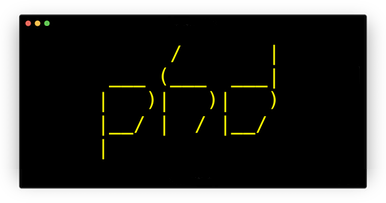

<!--
      /       |
 ___ (___  ___|
|   )|   )|   )
|__/ |  / |__/
|
-->

  

---

`phd` is a small, easy-to-use gopher server.

Point it at a directory and it'll serve up all the text files,
sub-directories, and binary files over Gopher. Any `.gph` files will
be served up as [gophermaps][map] and executable `.gph` files will be
run as a program with their output served to the client, like the
glorious cgi-bin days of yore!

### ~ special files ~

- **`header.gph`**: If it exists in a directory, its content will be
  shown above the directory's content. Put ASCII art in it.
- **`footer.gph`**: Same, but will be shown below a directory's content.
- **`index.gph`**: Completely replaces a directory's content with what's
  in this file.
- **`??.gph`**: Visiting `gopher://yoursite/1/dog/` will try to render
  `dog.gph` from disk. Visiting `/1/dog.gph` will render the raw
  content of the .gph file.
- **`.reverse`**: If this exists, the directory contents will be listed
  in reverse alphanumeric order. Useful for phloggin', if you date
  your posts.

Any line in a `.gph` file that doesn't contain tabs (`\t`) will get an
`i` automatically prefixed, turning it into a Gopher information item.

For your convenience, phd supports **[geomyidae][gmi]** syntax for
creating links:

    This is an info line.
    [1|This is a link|/help|server|port]
    [h|URL Link|URL:https://noogle.com]

`server` and `port` will get translated into the server and port of
the actively running server, eg `localhost` and `7070`.

Any line containing a tab character (`\t`) will be sent as-is to the
client, meaning you can write and serve up raw Gophermap files too.

### ~ dynamic content ~

Any `.gph` file that is marked **executable** with be run as if it
were a standalone program and its output will be sent to the client.
It will be passed three arguments: the query string (if any), the
server's hostname, and the current port. Do with them what you will.

For example:

    $ cat echo.gph
    #!/bin/sh
    echo "Hi, world! You said:" $1
    echo "1Visit Gopherpedia	/	gopherpedia.com	70"

Then:

    $ gopher-client gopher://localhost/1/echo?something
    [INFO] Hi, world! You said: something
    [LINK] Visit Gopherpedia

Or more seriously:

    $ cat figlet.gph
    #!/bin/sh
    figlet $1

then:

    $ gopher-client gopher://localhost/1/figlet?hi gopher
    [INFO]  _     _                     _
    [INFO] | |__ (_)   __ _  ___  _ __ | |__   ___ _ __
    [INFO] | '_ \| |  / _` |/ _ \| '_ \| '_ \ / _ \ '__|
    [INFO] | | | | | | (_| | (_) | |_) | | | |  __/ |
    [INFO] |_| |_|_|  \__, |\___/| .__/|_| |_|\___|_|
    [INFO]            |___/      |_|

### ~ ruby on rails ~

`sh` is fun, but for serious work you need a serious scripting
language like Ruby or PHP or Node.JS:

    $ cat sizes.gph
    #!/usr/bin/env ruby

    def filesize(file)
        (size=File.size file) > (k=1024) ? "#{size/k}K" : "#{size}B"
    end

    puts "~ file sizes ~"
    spaces = 20
    Dir[__dir__ + "/*"].each do |entry|
        name = File.basename entry
        puts "#{name}#{' ' * (spaces - name.length)}#{filesize entry}"
    end

Now you can finally share the file sizes of a directory with the world
of Gopher!

    $ phetch -r 0.0.0.0:7070/1/sizes
    i~ file sizes ~	(null)	127.0.0.1	7070
    iCargo.toml          731B	(null)	127.0.0.1	7070
    iLICENSE             1K	(null)	127.0.0.1	7070
    iMakefile            724B	(null)	127.0.0.1	7070
    itarget              288B	(null)	127.0.0.1	7070
    iphd                 248K	(null)	127.0.0.1	7070
    iCargo.lock          2K	(null)	127.0.0.1	7070
    iREADME.md           4K	(null)	127.0.0.1	7070
    img                 96B	(null)	127.0.0.1	7070
    isizes.gph           276B	(null)	127.0.0.1	7070
    isrc                 224B	(null)	127.0.0.1	7070

## ~ usage ~

    Usage:

        phd [options] <root directory>

    Options:

        -r, --render SELECTOR  Render and print SELECTOR to stdout only.
        -h, --host HOST        Hostname for links. [Default: {host}]
        -p, --port PORT        Port for links. [Default: {port}]
        -b, --bind ADDRESS     Socket address to bind to. [Default: {bind}]
        --no-color             Don't show colors in log messages.

    Other flags:

        -h, --help      Print this screen.
        -v, --version   Print phd version.

    Examples:

        phd ./path/to/site  # Serve directory over port 7070.
        phd -p 70 docs      # Serve 'docs' directory on port 70
        phd -h gopher.com   # Serve current directory over port 7070
                            # using hostname 'gopher.com'
        phd -r / ./site     # Render local gopher site to stdout.

## ~ installation ~

On macOS you can install with [Homebrew](https://brew.sh/):

    brew install xvxx/code/phd

Binaries for Linux, Mac, and Raspberry Pi are available at
gopher://phkt.io/1/releases/phd and https://github.com/xvxx/phd/releases:

- [phd-v0.1.12-linux-x86_64.tar.gz][0]
- [phd-v0.1.12-linux-armv7.tar.gz (Raspberry Pi)][1]
- [phd-v0.1.12-macos.zip][2]

Just unzip/untar the `phd` program into your `$PATH` and get going!

If you have **[cargo][rustup]**, you can install the crate directly:

    cargo install phd

## ~ development ~

    cargo run -- ./path/to/gopher/site

## ~ resources ~

- gopher://bitreich.org/1/scm/geomyidae/files.gph
- https://github.com/gophernicus/gophernicus/blob/master/README.Gophermap
- https://gopher.zone/posts/how-to-gophermap/
- [rfc 1436](https://tools.ietf.org/html/rfc1436)

## ~ todo ~

- [ ] systemd config, or something
- [ ] TLS support
- [ ] user input sanitization tests

[0]: https://github.com/xvxx/phd/releases/download/v0.1.12/phd-v0.1.12-linux-x86_64.tar.gz
[1]: https://github.com/xvxx/phd/releases/download/v0.1.12/phd-v0.1.12-linux-armv7.tar.gz
[2]: https://github.com/xvxx/phd/releases/download/v0.1.12/phd-v0.1.12-macos.zip
[map]: https://en.wikipedia.org/wiki/Gopher_(protocol)#Source_code_of_a_menu
[gmi]: http://r-36.net/scm/geomyidae/
[rustup]: https://rustup.rs
